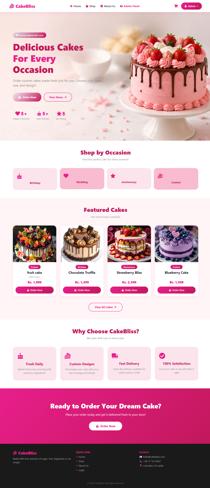
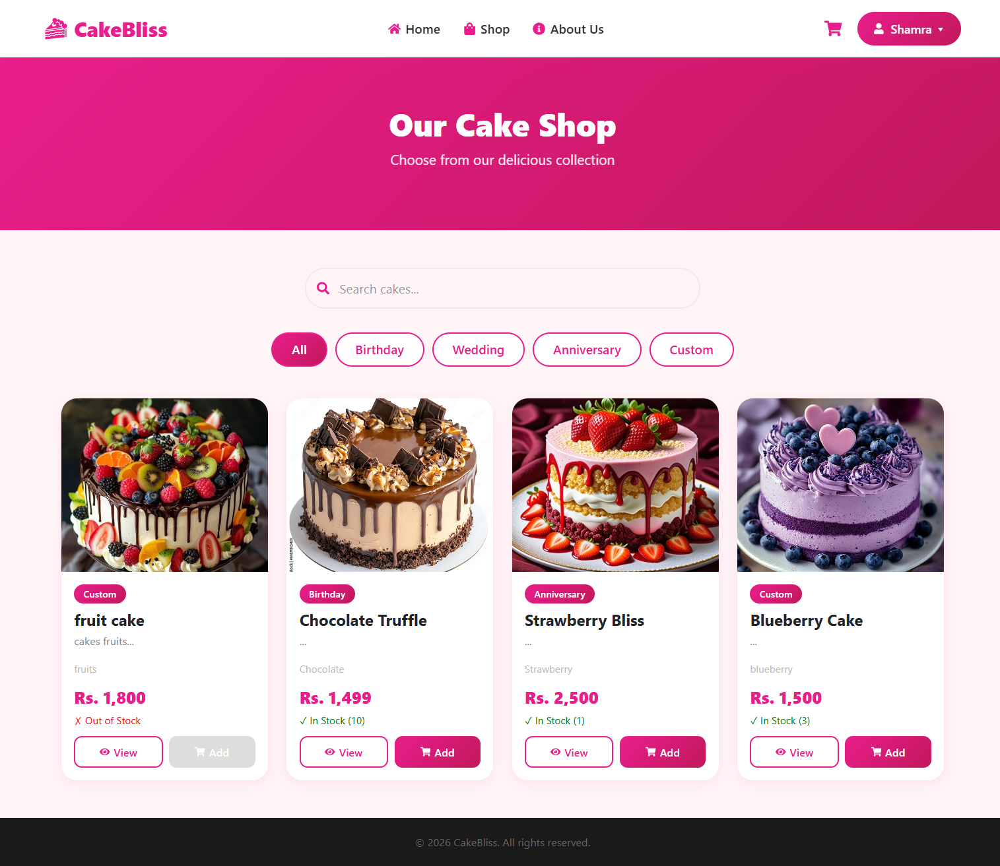
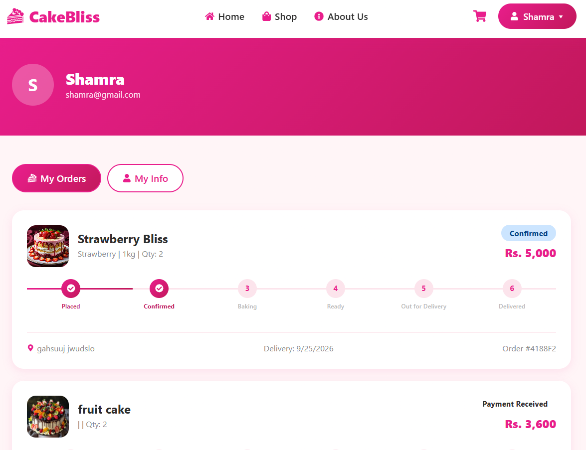
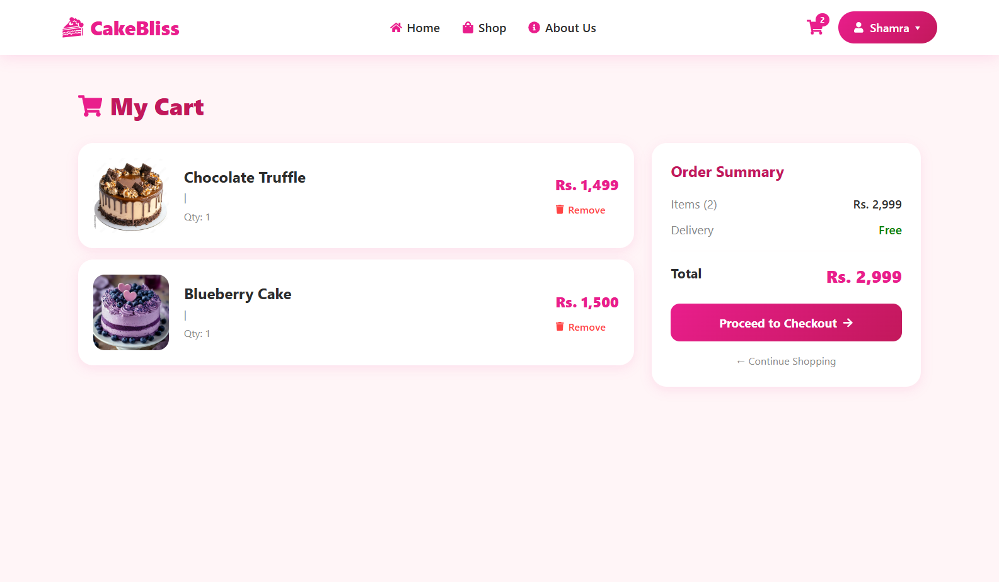
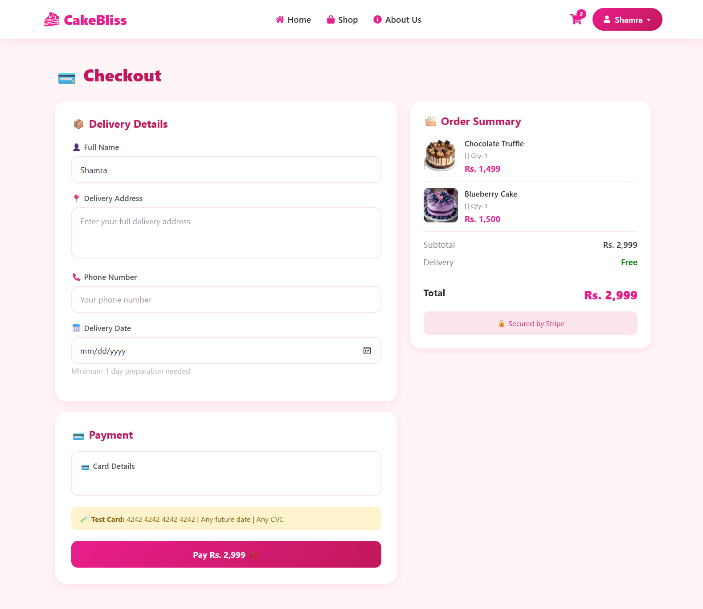
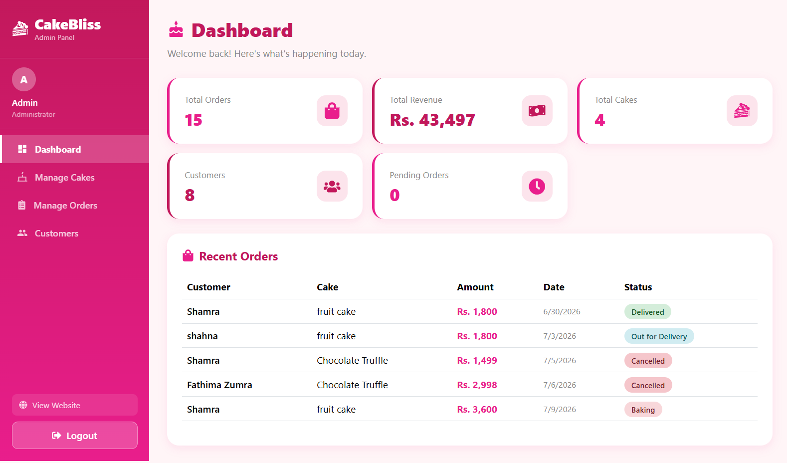

# 🎂 Cakebliss

A cake shopping website where users can browse cakes, add them to the cart and pay online.

## Screenshots

### Home Page


### Products Page


### Orders Page


### Cart


### Checkout


### Admin Dashboard



## Features

- Browse cakes
- Add to cart
- Online payment with Stripe
- (add your own features here)

## Built With

- React + Vite (client)
- Node.js (server)
- Stripe (payments)

## How to Run

### 1. Client
```
cd client
npm install
npm run dev
```

### 2. Server
```
cd server
npm install
npm start
```

### 3. Environment variables
Create a file named `.env` inside the `server` folder and add your own keys:

```
STRIPE_SECRET_KEY=your_key_here
```

## Author

Amriya Iqbal